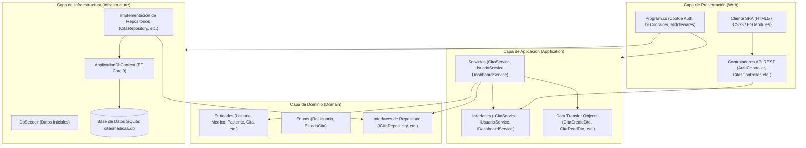

# 🏥 VITALIS CARE: DOCUMENTO MAESTRO DE CONTEXTO Y ARQUITECTURA TÉCNICA
> **Plataforma Integral de Gestión de Citas Médicas y Salud Digital**  
> *Documento consolidado de especificación, arquitectura, reglas de negocio, código y aseguramiento de calidad (QA), optimizado para análisis, auditoría y revisión por Inteligencia Artificial.*

---

## 🤖 INSTRUCCIÓN PARA LA IA REVISORA

```text
Eres un Arquitecto de Software Senior y Auditor de Seguridad / Calidad de Código.
A continuación tienes la radiografía técnica completa del sistema "Vitalis Care".
Lee este documento exhaustivamente. Encontrarás:
1. Resumen ejecutivo y stack tecnológico dual (.NET 9 Clean Architecture + Firebase Cloud + SPA Vanilla).
2. Estructura de archivos y árbol de directorios del repositorio.
3. Modelos de datos, entidades de dominio y esquemas de persistencia (SQLite + Firestore).
4. Reglas de negocio clínicas y algoritmos críticos (solapamiento, política de 24h, turnos).
5. Especificación completa de la API REST y contratos HTTP.
6. Arquitectura del frontend (SPA modular en JavaScript, CSS design system, manejo de estado reactivo).
7. Capa de resiliencia y servicios en la nube (Firebase Auth + Cloud Firestore + modo fallback local).
8. Suite de calidad de software (QA: 63 pruebas automatizadas - Humo, Aceptación BDD, Exploratorias SBTM y Unitarias).
9. Guía de ejecución, comandos y credenciales demo.
10. Preguntas y objetivos específicos para tu auditoría y revisión.
```

---

## 📑 1. RESUMEN EJECUTIVO Y FICHA TÉCNICA

| Parámetro | Detalle |
| :--- | :--- |
| **Nombre del Sistema** | **Vitalis Care** (Plataforma de Gestión de Citas Médicas y Salud Digital) |
| **Dominio de Negocio** | Telemedicina, agendamiento de consultas ambulatorias y gestión de turnos médicos |
| **Actores / Roles** | • **Paciente:** Búsqueda de especialistas, reserva interactiva de turnos libres, consulta de historial y cancelación.<br>• **Médico:** Gestión de agenda diaria, consulta de citas asignadas, cambio de estado (Confirmar / Completar).<br>• **Administrador:** Métricas operativas, control global de citas, catálogo de médicos y pacientes. |
| **Paradigma Backend** | **Dual Backend Resiliente:**<br>1. **API REST C# .NET 9:** Clean Architecture (Domain, Application, Infrastructure, Web) con Entity Framework Core y SQLite.<br>2. **Servicio Cloud Firebase:** Firebase Authentication + Cloud Firestore NoSQL en tiempo real con capa de persistencia resiliente y contingencia local. |
| **Paradigma Frontend** | **Single Page Application (SPA):** HTML5 semántico, CSS3 modular (diseño responsivo, paleta clínica, variables CSS, micro-animaciones) y JavaScript modular (ES Modules) con gestión de estado reactiva sin frameworks pesados. |
| **Estrategia de Pruebas** | **63 Pruebas Automatizadas (100% pasadas):**<br>• 19 pruebas unitarias en C# (.NET 9 + xUnit + Moq)<br>• 44 pruebas en JavaScript (Node.js Test Runner `node:test`): 6 de Humo, 7 de Aceptación (BDD), 12 Exploratorias (SBTM) y 19 Unitarias de validación y UI. |
| **Seguridad Implementada** | Hash BCrypt para contraseñas, sanitización anti-XSS (`escapeHtml`), truncado contra ataques DoS/Buffer Overflow, purgado de bytes nulos, cookies de autenticación con `HttpOnly` y protección de rutas por rol. |

---

## 📂 2. ESTRUCTURA COMPLETA DEL REPOSITORIO

```text
CitasMedicas/
├── CitasMedicas.sln                          # Solución principal de .NET 9
├── Directory.Build.props                      # Configuración global de compilación de .NET
├── package.json                              # Configuración de suites de prueba en Node.js
├── run-tests.ps1                             # Script PowerShell para ejecutar las 63 pruebas
├── run-tests.bat                             # Script Batch de ejecución con doble clic
├── README.md                                 # Guía inicial del repositorio
├── GUIA_EXPOSICION.md                        # Guion y preguntas para sustentación académica
├── firebase.json                             # Configuración del hosting y despliegue de Firebase
├── .firebaserc                               # Proyecto activo de Firebase (vitalis-care-f0e5e)
│
├── CitasMedicas.Domain/                      # CAPA 1: NÚCLEO PURO DE DOMINIO (Sin dependencias externas)
│   ├── Entities/
│   │   ├── Usuario.cs                        # Identidad base, credenciales, rol y relaciones
│   │   ├── Medico.cs                         # Especialidad, licencia médica y disponibilidades
│   │   ├── Paciente.cs                       # Datos clínicos básicos y citas vinculadas
│   │   ├── Cita.cs                           # Entidad central: médico, paciente, fechas y estado
│   │   ├── DisponibilidadMedica.cs           # Franja de horario disponible configurada para un médico
│   │   └── Notificacion.cs                   # Mensajes/recordatorios asociados a una cita
│   ├── Enums/
│   │   ├── RolUsuario.cs                     # Enum: Admin, Medico, Paciente
│   │   └── EstadoCita.cs                     # Enum: Pendiente, Confirmada, Cancelada, Completada
│   └── Interfaces/
│       ├── IRepository.cs                    # Contrato genérico de persistencia CRUD
│       ├── ICitaRepository.cs                # Búsqueda por médico/paciente, solapamientos y reservas
│       ├── IUsuarioRepository.cs             # Autenticación, búsqueda por correo y roles
│       └── IDashboardRepository.cs           # Agregaciones y métricas para el panel administrativo
│
├── CitasMedicas.Application/                 # CAPA 2: CASOS DE USO Y REGLAS DE NEGOCIO
│   ├── DTOs/
│   │   ├── CitaCreateDto.cs                  # Input para agendar cita (médico, paciente, fechas, motivo)
│   │   ├── CitaReadDto.cs                    # Output seguro para cliente HTTP (nombres, fechas, estado)
│   │   ├── CitaCambiarEstadoDto.cs           # Input para transiciones de estado clínico
│   │   ├── UserLoginDto.cs                   # Credenciales de acceso (email y password)
│   │   ├── UserRegisterDto.cs                # Registro de nuevos pacientes
│   │   └── DashboardStatsDto.cs              # Agrupación de métricas para admin
│   ├── Interfaces/
│   │   ├── ICitaService.cs                   # Contrato de casos de uso de citas
│   │   ├── IUsuarioService.cs                # Contrato de autenticación y gestión de usuarios
│   │   └── IDashboardService.cs              # Contrato para estadísticas
│   └── Services/
│       ├── CitaService.cs                    # Implementación de reglas clínicas y orquestación
│       ├── UsuarioService.cs                 # Hash BCrypt, validación de credenciales y creación
│       └── DashboardService.cs               # Consulta de estadísticas globales
│
├── CitasMedicas.Infrastructure/              # CAPA 3: PERSISTENCIA Y ADAPTADORES EXTERNOS
│   ├── Data/
│   │   ├── ApplicationDbContext.cs           # DbContext de EF Core, mapeos Fluent API, índices únicos
│   │   └── DbSeeder.cs                       # Semilla automática con médicos, usuarios y horarios
│   ├── Repositories/
│   │   ├── Repository.cs                     # Implementación genérica sobre DbSet<T>
│   │   ├── CitaRepository.cs                 # Consultas LINQ con NoTracking y detección de cruces
│   │   ├── UsuarioRepository.cs              # Consultas de usuarios con Include(Medico/Paciente)
│   │   └── DashboardRepository.cs            # Conteos optimizados de estados en BD
│   └── DependencyInjection.cs                # Registro de DbContext y repositorios en IServiceCollection
│
├── CitasMedicas.Web/                         # CAPA 4: API HTTP Y SERVIDOR DE ARCHIVOS SPA
│   ├── Controllers/
│   │   ├── AuthController.cs                 # Endpoints /api/auth (login, register, me, logout)
│   │   ├── CitasController.cs                # Endpoints /api/citas (CRUD, cancelar, cambiar estado)
│   │   ├── MedicosController.cs              # Endpoint público /api/medicos y disponibilidades
│   │   └── DashboardController.cs            # Endpoint seguro /api/dashboard/stats (Rol Admin)
│   ├── Program.cs                            # Pipeline HTTP, cookies auth, DI y healthcheck
│   ├── appsettings.json                      # Cadenas de conexión (citasmedicas.db) y configuración
│   └── wwwroot/                              # FRONTEND WEB SPA
│       ├── index.html                        # SPA con landing, 3 paneles por rol y modales
│       ├── css/
│       │   └── styles.css                    # Sistema de diseño, paleta clínica, responsive y animaciones
│       └── js/
│           ├── app.js                        # Controlador de UI, estado, slot-generator y eventos
│           ├── firebase-config.js            # Credenciales del SDK Web de Firebase
│           └── firebase-service.js           # Servicio dual Firestore/Auth + contingencia local
│
├── CitasMedicas.UnitTests/                   # PRUEBAS UNITARIAS DE BACKEND (.NET 9 / C#)
│   └── Services/
│       ├── CitaServiceTests.cs               # 12 pruebas con xUnit y Moq sobre CitaService
│       └── UsuarioServiceTests.cs            # 7 pruebas de registro, hashing y autenticación
│
├── tests/                                    # SUITE DE PRUEBAS DE AUTOMATIZACIÓN (JavaScript / Node.js)
│   ├── smoke.test.js                         # 6 pruebas de humo: salud vital, integridad y arranque
│   ├── acceptance.test.js                    # 7 escenarios BDD: Paciente, Médico, Admin, Privacidad
│   ├── exploratory.test.js                   # 12 pruebas SBTM: XSS, SQLi, DoS, límites de 24h, concurrencia
│   ├── authRules.test.js                     # 5 pruebas de validación de registro y credenciales
│   ├── citaRules.test.js                     # 10 pruebas de reglas de negocio y cálculo de solapamiento
│   └── uiHelpers.test.js                     # 4 pruebas de utilidades de interfaz (slots, escapeHtml)
│
└── docs/                                     # DOCUMENTACIÓN TÉCNICA Y REPORTES
    ├── ARQUITECTURA.md                       # Documento de arquitectura N-Tier y diseño
    ├── DIAGRAMAS_UML.md                      # Diagramas formales: Casos de uso, Clases, Secuencia, DER
    ├── INFORME_PRUEBAS.md                    # Reporte formal de aseguramiento de calidad (QA)
    └── INFORME_PRUEBAS.html                  # Versión interactiva para exportar a PDF
```

---

## 🏛️ 3. ARQUITECTURA DEL SISTEMA Y PATRONES DE DISEÑO

### 3.1 Clean Architecture / N-Tier (.NET 9)

El backend en C# sigue escrupulosamente los principios de Inversión de Dependencias (DIP) y Separación de Incumbencias (SoC):



### 3.2 Regla de Dependencias
1. **`Domain`**: Nivel más interno. No tiene referencias a ningún paquete NuGet ni a otros proyectos. Contiene únicamente lógica pura de entidades, invariantes y contratos.
2. **`Application`**: Depende exclusivamente de `Domain`. Modela los casos de uso, transformaciones a DTOs y validaciones de negocio. No sabe si la base de datos es SQLite, SQL Server o un Mock de memoria.
3. **`Infrastructure`**: Depende de `Domain` y de `Application`. Implementa las interfaces mediante Entity Framework Core, LINQ y SQLite.
4. **`Web`**: Depende de `Domain`, `Application` e `Infrastructure`. Configura el contenedor de inyección de dependencias, la autenticación por cookies y expone la API HTTP junto con los archivos estáticos de la SPA.

### 3.3 Arquitectura Dual Resiliente con Firebase

Para despliegues ágiles en la nube y sincronización en tiempo real sin requerir un servidor dedicado permanente, la aplicación incorpora un adaptador en el frontend (`firebase-service.js`):
- **Modo Online Cloud:** Utiliza el SDK Web oficial de Firebase para autenticar usuarios con Firebase Auth y almacenar citas en Cloud Firestore (`vitalis-care-f0e5e`).
- **Modo Contingencia / Demo:** Si la conexión a Firebase no responde, o durante pruebas locales en navegadores sin conexión a internet, el servicio conmuta de forma transparente a un almacén en `localStorage` con datos semilla idénticos, garantizando 100% de disponibilidad.

---

## 🗄️ 4. MODELO DE DATOS Y PERSISTENCIA

### 4.1 Entidades del Dominio

#### 1. `Usuario`
```csharp
public class Usuario
{
    public int Id { get; set; }
    public string NombreCompleto { get; set; } = string.Empty;
    public string Email { get; set; } = string.Empty;
    public string PasswordHash { get; set; } = string.Empty;
    public RolUsuario Rol { get; set; }
    public DateTime FechaCreacion { get; set; } = DateTime.UtcNow;

    public Medico? Medico { get; set; }
    public Paciente? Paciente { get; set; }
}
```

#### 2. `Medico`
```csharp
public class Medico
{
    public int Id { get; set; }
    public int UsuarioId { get; set; }
    public Usuario Usuario { get; set; } = null!;
    public string Especialidad { get; set; } = string.Empty;
    public string NumeroLicencia { get; set; } = string.Empty;

    public ICollection<DisponibilidadMedica> Disponibilidades { get; set; } = [];
    public ICollection<Cita> Citas { get; set; } = [];
}
```

#### 3. `Paciente`
```csharp
public class Paciente
{
    public int Id { get; set; }
    public int UsuarioId { get; set; }
    public Usuario Usuario { get; set; } = null!;
    public DateTime? FechaNacimiento { get; set; }
    public string Telefono { get; set; } = string.Empty;

    public ICollection<Cita> Citas { get; set; } = [];
}
```

#### 4. `Cita`
```csharp
public class Cita
{
    public int Id { get; set; }
    public int MedicoId { get; set; }
    public Medico Medico { get; set; } = null!;
    public int PacienteId { get; set; }
    public Paciente Paciente { get; set; } = null!;
    public DateTime Inicio { get; set; }
    public DateTime Fin { get; set; }
    public string Motivo { get; set; } = string.Empty;
    public EstadoCita Estado { get; set; } = EstadoCita.Pendiente;
    public DateTime FechaCreacion { get; set; } = DateTime.UtcNow;

    public ICollection<Notificacion> Notificaciones { get; set; } = [];
}
```

#### 5. `DisponibilidadMedica`
```csharp
public class DisponibilidadMedica
{
    public int Id { get; set; }
    public int MedicoId { get; set; }
    public Medico Medico { get; set; } = null!;
    public DateTime Inicio { get; set; }
    public DateTime Fin { get; set; }
    public bool Disponible { get; set; } = true;
}
```

### 4.2 Enumeraciones

```csharp
public enum RolUsuario { Admin, Medico, Paciente }

public enum EstadoCita { Pendiente, Confirmada, Cancelada, Completada }
```

### 4.3 Mapeo y Restricciones en `ApplicationDbContext`

- **Índices Únicos:** `Email` en `Usuario` y `NumeroLicencia` en `Medico`.
- **Conversión de Enums:** Enums persistidos como texto (`string`) para portabilidad entre motores de base de datos.
- **Relaciones y Cascada:**
  - `Usuario` &rarr; `Medico` / `Paciente` (1 a 1, `OnDelete(DeleteBehavior.Cascade)`).
  - `Medico` / `Paciente` &rarr; `Cita` (1 a N, `OnDelete(DeleteBehavior.Restrict)` para evitar borrado accidental de historias clínicas).
  - `Medico` &rarr; `DisponibilidadMedica` (1 a N, `OnDelete(DeleteBehavior.Cascade)`).

---

## ⚖️ 5. REGLAS DE NEGOCIO CLÍNICAS Y ALGORITMOS

Tanto el servicio en C# (`CitaService.cs`) como el servicio en JavaScript/Firebase (`firebase-service.js` y `citaRules.test.js`) implementan y prueban de forma idéntica las siguientes **8 reglas fundamentales**:

### Regla 1: Cronología e Inmediatez Temporal
* **Definición:** La hora de inicio de la cita debe ser estrictamente anterior a la hora de fin (`Inicio < Fin`).
* **Regla:** La cita debe programarse estrictamente en el futuro respecto a la hora actual (`Inicio > DateTime.UtcNow`).
* **Código C# (`CitaService.cs`):**
  ```csharp
  if (dto.Inicio >= dto.Fin)
      throw new ArgumentException("La hora de inicio debe ser anterior a la hora de fin.");
  if (dto.Inicio <= DateTime.Now)
      throw new ArgumentException("La cita debe programarse en el futuro.");
  ```

### Regla 2: Prevención Estricta de Solapamiento Clínico (*Anti-Overlap*)
* **Definición:** Un médico no puede tener dos consultas simultáneas ni solapadas en ninguna fracción de tiempo.
* **Algoritmo de Detección:** Dos intervalos $[I_1, F_1]$ e $[I_2, F_2]$ se cruzan si y solo si:
  $$\text{Overlap} \iff (I_1 < F_2) \land (F_1 > I_2)$$
* **Exclusión:** Las citas con estado `Cancelada` se ignoran en el cálculo.
* **Implementación LINQ (`CitaRepository.cs`):**
  ```csharp
  return await context.Citas.AnyAsync(c =>
      c.MedicoId == medicoId &&
      c.Estado != EstadoCita.Cancelada &&
      inicio < c.Fin &&
      fin > c.Inicio,
      cancellationToken);
  ```

### Regla 3: Política de Cancelación con 24 Horas de Anticipación
* **Definición:** Por respeto a la agenda del facultativo y a otros pacientes en lista de espera, la cancelación voluntaria requiere al menos 24 horas de antelación respecto al inicio pactado.
* **Casos Límite Probados:**
  - Solicitud a las **24 horas y 1 segundo** antes &rarr; **Permitida**.
  - Solicitud a las **23 horas, 59 minutos y 59 segundos** antes &rarr; **Rechazada con excepción**.
* **Código C# (`CitaService.cs`):**
  ```csharp
  if (cita.Inicio <= DateTime.Now.AddHours(24))
      throw new InvalidOperationException("La cancelación debe hacerse con al menos 24 horas de anticipación.");
  cita.Estado = EstadoCita.Cancelada;
  ```

### Regla 4: Inmutabilidad de Estados Terminales
* **Definición:** Una cita en estado `Cancelada` o `Completada` constituye un registro cerrado e inmutable. No puede ser reactivada ni transicionar nuevamente a `Pendiente` o `Confirmada`.
* **Código C# (`CitaService.cs`):**
  ```csharp
  if (cita.Estado is EstadoCita.Cancelada or EstadoCita.Completada)
      throw new InvalidOperationException("La cita no puede cancelarse en su estado actual.");
  if (cita.Estado == EstadoCita.Cancelada && nuevoEstado != EstadoCita.Cancelada)
      throw new InvalidOperationException("No se puede modificar una cita cancelada.");
  ```

### Regla 5: Fragmentación Dinámica de Jornadas (`generateHourlySlots`)
* **Definición:** El horario de atención del médico (ej. de 09:00 a 17:00) se divide en el cliente en bloques indivisibles de exactamente 60 minutos (09:00-10:00, 10:00-11:00, etc.).
* **Filtro de Pasado:** Si la fecha seleccionada es hoy, los bloques cuya hora de inicio ya haya transcurrido son eliminados dinámicamente de la lista de opciones seleccionables.

### Regla 6: Aislamiento y Privacidad de Datos
* **Definición:**
  - El paciente únicamente puede consultar sus propias citas (`GET /api/citas/paciente/{pacienteId}`).
  - El médico únicamente consulta su propia agenda (`GET /api/citas/medico/{medicoId}`).
  - El administrador tiene acceso a las métricas agregadas globales (`GET /api/dashboard/stats`).

### Regla 7: Sanitización XSS y Contención de Payloads Maliciosos
* **Definición:** Toda entrada de texto (como el motivo de consulta) es sanitizada convirtiendo caracteres de inyección HTML (`<`, `>`, `&`, `"`, `'`) en entidades seguras.
* **Contención de Buffer/DoS:** Payloads que excedan 500 caracteres son acotados estrictamente para evitar fugas de memoria o saturación de almacenamiento.
* **Purgado de Control:** Se remueven caracteres nulos (`\0`) antes de persistir o evaluar.

### Regla 8: Manejo de Concurrencia y Condición de Carrera
* **Definición:** Ante dos peticiones HTTP o llamadas asíncronas concurrentes en el mismo milisegundo por el mismo turno de un médico, el sistema procesa una sola de manera atómica y rechaza la segunda con error de conflicto (`409 Conflict`).

---

## 🌐 6. ESPECIFICACIÓN DE LA API REST (.NET 9 HTTP CONTRACTS)

### 6.1 Rutas de Autenticación (`/api/auth`)

#### `POST /api/auth/login`
* **Acceso:** Público (`AllowAnonymous`).
* **Request Body:**
  ```json
  {
    "email": "admin@citas.local",
    "password": "Admin123!"
  }
  ```
* **Respuesta Exitosa (200 OK + Cookie `CitasMedicas.Auth`):**
  ```json
  {
    "id": 1,
    "nombreCompleto": "Administrador",
    "email": "admin@citas.local",
    "rol": "Admin",
    "pacienteId": null,
    "medicoId": null
  }
  ```
* **Errores:** `401 Unauthorized` si las credenciales no coinciden con el hash BCrypt.

#### `POST /api/auth/register`
* **Acceso:** Público (`AllowAnonymous`). Registra nuevos usuarios con rol `Paciente`.
* **Request Body:**
  ```json
  {
    "nombreCompleto": "Carlos Ruiz",
    "email": "carlos@citas.local",
    "password": "Password123!",
    "telefono": "+34 600 123 456",
    "fechaNacimiento": "1990-05-15T00:00:00"
  }
  ```
* **Respuesta Exitosa:** `201 Created` con el perfil del usuario creado y sesión iniciada en cookie.
* **Errores:** `400 Bad Request` (campos faltantes), `409 Conflict` (correo ya registrado).

#### `GET /api/auth/me`
* **Acceso:** Requiere Autenticación (`Authorize`).
* **Respuesta Exitosa (200 OK):** Devuelve la identidad extraída de los claims de la cookie (`NameIdentifier`, `Email`, `Role`).

#### `POST /api/auth/logout`
* **Acceso:** Requiere Autenticación (`Authorize`).
* **Respuesta Exitosa (204 No Content):** Invalida y elimina la cookie de sesión.

---

### 6.2 Rutas de Médicos (`/api/medicos`)

#### `GET /api/medicos`
* **Acceso:** Público (`AllowAnonymous`).
* **Respuesta Exitosa (200 OK):**
  ```json
  [
    {
      "id": 1,
      "especialidad": "Cardiología",
      "numeroLicencia": "MED-1001",
      "nombre": "Dra. Ana García",
      "disponibilidades": [
        { "id": 1, "inicio": "2026-09-20T09:00:00", "fin": "2026-09-20T17:00:00", "disponible": true }
      ]
    }
  ]
  ```

---

### 6.3 Rutas de Citas Médicas (`/api/citas`)

#### `POST /api/citas`
* **Acceso:** Autenticado (`Authorize`).
* **Request Body:**
  ```json
  {
    "medicoId": 1,
    "pacienteId": 1,
    "inicio": "2026-09-20T10:00:00",
    "fin": "2026-09-20T11:00:00",
    "motivo": "Revisión cardiológica anual"
  }
  ```
* **Respuesta Exitosa (201 Created):**
  ```json
  {
    "id": 15,
    "medicoId": 1,
    "medicoNombre": "Dra. Ana García",
    "pacienteId": 1,
    "pacienteNombre": "María López",
    "inicio": "2026-09-20T10:00:00",
    "fin": "2026-09-20T11:00:00",
    "motivo": "Revisión cardiológica anual",
    "estado": "Pendiente"
  }
  ```
* **Errores:**
  - `400 Bad Request`: Horas invertidas o fecha en el pasado.
  - `404 Not Found`: Médico o paciente no existen.
  - `409 Conflict`: Horario solapado o disponibilidad no encontrada.

#### `GET /api/citas/{id}`
* **Acceso:** Autenticado. Devuelve el detalle de una cita específica.

#### `GET /api/citas/paciente/{pacienteId}`
* **Acceso:** Autenticado. Devuelve la lista de citas del paciente indicado.

#### `GET /api/citas/medico/{medicoId}`
* **Acceso:** Autenticado. Devuelve la agenda de citas del médico indicado.

#### `POST /api/citas/{id}/cancelar`
* **Acceso:** Autenticado.
* **Respuesta Exitosa:** `204 No Content`.
* **Errores:** `409 Conflict` si faltan menos de 24 horas para el inicio o la cita ya está cerrada.

#### `POST /api/citas/{id}/estado`
* **Acceso:** Autenticado. Usado por médicos para transicionar el estado (`Confirmada`, `Completada`).
* **Request Body:** `{ "nuevoEstado": "Confirmada" }`
* **Respuesta Exitosa:** `204 No Content`.

---

### 6.4 Rutas de Administración (`/api/dashboard`)

#### `GET /api/dashboard/stats`
* **Acceso:** Restringido exclusivamente al rol `Admin` (`[Authorize(Roles = "Admin")]`).
* **Respuesta Exitosa (200 OK):**
  ```json
  {
    "totalCitas": 42,
    "citasPendientes": 10,
    "citasConfirmadas": 18,
    "citasCompletadas": 12,
    "citasCanceladas": 2,
    "totalMedicos": 5,
    "totalPacientes": 80
  }
  ```
* **Errores:** `401 Unauthorized` (no autenticado), `403 Forbidden` (autenticado como Paciente o Médico pero sin rol Admin).

---

## 💻 7. CAPA FRONTEND (SINGLE PAGE APPLICATION)

### 7.1 Principios de Construcción
1. **Zero Framework Bloat:** Desarrollado en JavaScript moderno (ES Modules) nativo, sin dependencias pesadas tipo React/Angular. Carga ultrarrápida en cualquier navegador.
2. **Navegación Reactiva:** Función `switchView(viewName)` que alterna entre la Landing pública, el portal de Paciente, la agenda del Médico y el panel del Administrador en milisegundos mediante manipulación del DOM y clases CSS activas.
3. **Barra de Acceso Rápido Demo (1 Clic):** Permite a evaluadores ingresar instantáneamente a la cuenta de prueba de María (Paciente), Dra. Ana (Médico) o Admin sin tener que escribir contraseñas.
4. **Diseño Visual Médico:** Paleta HSL con azul clínico (`#0284c7`), verde teal (`#0d9488`), tarjetas con elevación suave (`box-shadow`), badges de estado con colores semánticos (`warning`, `info`, `success`, `danger`) y botones horarios interactivos (`.slot-chip`).

### 7.2 Funciones Críticas del Cliente (`app.js`)

* **`generateHourlySlots(startStr, endStr, selectedDateStr)`:**
  Toma la ventana de atención (ej. 09:00 a 17:00) y el día elegido; produce un arreglo de objetos de turno `{ start, end, label, isPast }`. Descarta dinámicamente horarios ya vencidos.
* **`escapeHtml(str)`:**
  Sanitiza cualquier texto ingresado por el usuario antes de inyectarlo en plantillas literales (`innerHTML`), evitando inyecciones de código HTML/JS.
* **`renderPatientView()` / `renderDoctorView()` / `renderAdminDashboard()`:**
  Renderizadores especializados que refrescan listas de citas, botones de acción y tarjetas de métricas.

---

## 🧪 8. ESTRATEGIA DE ASEGURAMIENTO DE CALIDAD (QA) - 63 PRUEBAS

El proyecto cuenta con una pirámide de pruebas automatizada de **63 pruebas con 100% de tasa de éxito**:

```
                       ▲
                      / \
                     /   \
                    / 12  \    Pruebas Exploratorias (SBTM Charters)
                   /-------\
                  /    7    \   Pruebas de Aceptación (UAT / BDD)
                 /-----------\
                /      6      \  Pruebas de Humo (Smoke Testing)
               /---------------\
              /    19 + 19      \ Pruebas Unitarias (19 C# xUnit + 19 JS)
             /-------------------\
```

### 8.1 Desglose de Pruebas

| Suite / Archivo | Entorno | Cantidad | Enfoque Principal |
| :--- | :--- | :---: | :--- |
| [`tests/smoke.test.js`](file:///c:/Users/User/Documents/CitasMedicas/tests/smoke.test.js) | Node.js | **6** | Vitalidad de arranque: archivos estáticos presentes, médicos semilla, roles, login demo y credenciales Firebase. |
| [`tests/acceptance.test.js`](file:///c:/Users/User/Documents/CitasMedicas/tests/acceptance.test.js) | Node.js | **7** | Criterios de aceptación BDD (HU-01 a HU-07): reserva, solapamiento, transición médica, política de 24h, privacidad y métricas admin. |
| [`tests/exploratory.test.js`](file:///c:/Users/User/Documents/CitasMedicas/tests/exploratory.test.js) | Node.js | **12** | Charters SBTM: Ataques XSS, SQLi, Buffer DoS, bytes nulos, umbrales de 24h+1s vs 24h-1s, cruce de medianoche, condición de carrera con `Promise.all`, fuzzing UTF-8. |
| [`tests/authRules.test.js`](file:///c:/Users/User/Documents/CitasMedicas/tests/authRules.test.js) | Node.js | **5** | Validación de payloads de registro, correos duplicados insensibles a mayúsculas y longitud de password. |
| [`tests/citaRules.test.js`](file:///c:/Users/User/Documents/CitasMedicas/tests/citaRules.test.js) | Node.js | **10** | Algoritmos de rango de fechas, detección de solapamientos e inmutabilidad de estados cancelados. |
| [`tests/uiHelpers.test.js`](file:///c:/Users/User/Documents/CitasMedicas/tests/uiHelpers.test.js) | Node.js | **4** | División de turnos por hora, exclusión de horas pasadas y escape de caracteres HTML. |
| [`CitasMedicas.UnitTests`](file:///c:/Users/User/Documents/CitasMedicas/CitasMedicas.UnitTests) | .NET 9 xUnit | **19** | Casos de uso de backend con simulación de repositorios vía Moq (`CitaServiceTests` y `UsuarioServiceTests`). |
| **TOTAL CONSOLIDADO** | **Híbrido** | **63** | **100% Pasadas (0 fallos)** |

---

## 👥 9. USUARIOS SEMILLA Y CREDENCIALES DEMO

Para pruebas locales, demostraciones y suites de verificación se definieron las siguientes cuentas:

| Rol | Nombre | Correo Electrónico | Contraseña | Identificador |
| :--- | :--- | :--- | :--- | :--- |
| **Administrador** | Administrador | `admin@citas.local` | `Admin123!` | Rol global `Admin` |
| **Médico** | Dra. Ana García | `ana@citas.local` | `Medico123!` | Especialidad: Cardiología, Licencia: `MED-1001` |
| **Médico** | Dr. Luis Pérez | `luis@citas.local` | `Medico123!` | Especialidad: Dermatología, Licencia: `MED-1002` |
| **Paciente** | María López | `maria@citas.local` | `Paciente123!` | Paciente con citas activas de prueba |
| **Paciente** | Carlos Ruiz | `carlos@citas.local` | `Paciente123!` | Paciente secundario |

---

## 🚀 10. GUÍA DE EJECUCIÓN Y COMANDOS

### 10.1 Requisitos Previos
- **SDK de .NET:** .NET 8 o .NET 9 instalado (`dotnet --version`).
- **Node.js:** Versión 18+ o 20+ con soporte para `node:test` (`node --version`).

### 10.2 Ejecutar las Pruebas de Calidad
```powershell
# Ejecutar todas las 63 pruebas unificadas (C# + JavaScript):
.\run-tests.ps1

# O mediante npm:
npm test                  # Corre las 44 pruebas de JavaScript
npm run test:smoke        # Corre las 6 pruebas de humo
npm run test:acceptance   # Corre los 7 escenarios BDD de aceptación
npm run test:exploratory  # Corre las 12 pruebas exploratorias SBTM

# Para correr las 19 pruebas de C#:
dotnet test
```

### 10.3 Iniciar el Servidor Web Local
```bash
dotnet restore
dotnet build CitasMedicas.sln
dotnet run --project CitasMedicas.Web
```
*La aplicación abre por defecto en `http://localhost:5276` (o el puerto configurado en `launchSettings.json`).*

---

## 🎯 11. GUÍA Y PREGUNTAS SUGERIDAS PARA LA IA REVISORA

Estimada IA revisora, por favor analiza el proyecto bajo las siguientes directrices y proporciona tus observaciones, fortalezas detectadas y áreas de mejora:

1. **Auditoría de Arquitectura de Software:**
   - ¿Qué tan fielmente se respeta la separación de capas de Clean Architecture entre `Domain`, `Application`, `Infrastructure` y `Web`?
   - ¿Consideras adecuada la inversión de dependencias con el patrón repositorio frente al uso directo de DbContext?
2. **Auditoría de Seguridad y Resiliencia:**
   - Evalúa la política de autenticación por Cookies con `HttpOnly` frente a JWT para esta SPA.
   - ¿Cómo valoras la sanitización anti-XSS y el truncado contra Buffer Overflow/DoS en las pruebas exploratorias?
   - ¿Qué riesgos o mejoras identificas en la sincronización dual entre SQLite local y Firebase Cloud?
3. **Revisión de Reglas de Negocio Clínico:**
   - ¿El algoritmo de detección de solapamiento (`Inicio < c.Fin && Fin > c.Inicio`) cubre todos los casos de borde temporales?
   - ¿Qué opinas de la regla de 24 horas de cancelación y la inmutabilidad de los estados terminales (`Cancelada`, `Completada`)?
4. **Estrategia de Pruebas (QA):**
   - Evalúa la pirámide de pruebas (Humo, BDD Aceptación, SBTM Exploratorio y Unitarias duales en xUnit y Node.js).
   - ¿Qué escenarios de prueba adicionales recomendarías para llevar la cobertura a un nivel bancario o de grado médico crítico (HIPAA/GDPR)?
5. **Propuestas de Evolución y Escalabilidad:**
   - Sugiere 3 mejoras de alto impacto para la próxima versión (ej. WebSockets para notificaciones en vivo, pasarela de pagos para copago de citas, arquitectura multi-tenant para clínicas múltiples).
