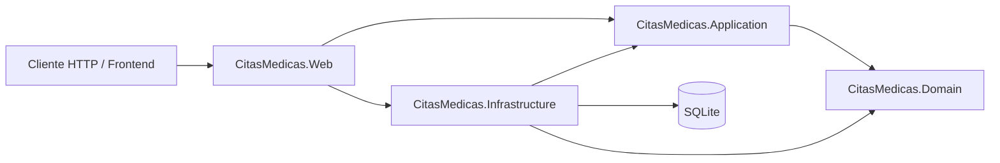

 # Documentación técnica

## 1. Resumen

La Plataforma de Gestión de Citas Médicas es una Web API ASP.NET Core organizada en capas con principios de Clean Architecture/N-Tier. Permite autenticar usuarios, consultar médicos, crear y cancelar citas, administrar disponibilidades y consultar estadísticas del sistema.

La solución está orientada a .NET 8 y utiliza SQLite para desarrollo local. Entity Framework Core concentra el acceso a datos y BCrypt.Net-Next protege las contraseñas mediante hash.

## 2. Arquitectura



Dependencias principales:

- `Domain` no depende de ninguna otra capa.
- `Application` depende de `Domain` y contiene casos de uso, DTOs e interfaces.
- `Infrastructure` implementa los repositorios y configura EF Core.
- `Web` expone HTTP, configura autenticación y compone la inyección de dependencias.

## 3. Estructura de carpetas

```text
CitasMedicas/
├── CitasMedicas.sln
├── CitasMedicas.Domain/
│   ├── Entities/
│   ├── Enums/
│   └── Interfaces/
├── CitasMedicas.Application/
│   ├── DTOs/
│   ├── Interfaces/
│   └── Services/
├── CitasMedicas.Infrastructure/
│   ├── Data/
│   ├── Repositories/
│   └── DependencyInjection.cs
├── CitasMedicas.Web/
│   ├── Controllers/
│   ├── Program.cs
│   └── appsettings.json
└── docs/
    └── ARQUITECTURA.md
```

## 4. Capa Domain

### Entidades

- `Usuario`: identidad, correo, hash de contraseña y rol.
- `Medico`: especialidad, licencia y disponibilidades.
- `Paciente`: datos básicos y citas asociadas.
- `Cita`: médico, paciente, intervalo, motivo y estado.
- `DisponibilidadMedica`: ventana de tiempo disponible para un médico.
- `Notificacion`: mensaje asociado a una cita.

### Enumeraciones

- `RolUsuario`: `Admin`, `Medico`, `Paciente`.
- `EstadoCita`: `Pendiente`, `Confirmada`, `Cancelada`, `Completada`.

### Interfaces

Los contratos `ICitaRepository`, `IUsuarioRepository` e `IDashboardRepository` aíslan la aplicación del mecanismo de persistencia. Esto permite reemplazar SQLite por SQL Server u otra implementación sin modificar los servicios de negocio.

## 5. Capa Application

### DTOs

- `CitaCreateDto`: datos necesarios para programar una cita.
- `CitaReadDto`: representación segura de una cita para respuestas HTTP.
- `UserLoginDto`: correo y contraseña de acceso.
- `DashboardStatsDto`: totales agrupados para el panel administrativo.

### Servicios

`CitaService` aplica las reglas principales:

1. La hora inicial debe ser anterior a la hora final.
2. La cita debe estar en el futuro.
3. El médico no puede tener otra cita activa solapada.
4. El médico y el paciente deben existir.
5. El intervalo debe pertenecer a una disponibilidad libre.
6. Al reservar, la ventana disponible se divide para retirar el tramo ocupado.
7. Una cita cancelada o completada no puede cancelarse.
8. La cancelación requiere al menos 24 horas de anticipación.

`UsuarioService` valida las credenciales con BCrypt y devuelve el usuario autenticado.

`DashboardService` obtiene las estadísticas mediante `IDashboardRepository` sin conocer EF Core.

## 6. Capa Infrastructure

### Base de datos

`ApplicationDbContext` configura:

- Índice único para el correo del usuario.
- Índice único para el número de licencia médica.
- Relaciones uno a uno entre `Usuario` y `Medico`/`Paciente`.
- Relaciones uno a muchos entre médicos, pacientes, citas, disponibilidades y notificaciones.
- Conversión de enums a texto en SQLite.
- Restricción de borrado para evitar eliminar médicos o pacientes con citas accidentalmente.

La conexión predeterminada es:

```text
Data Source=citasmedicas.db
```

La base se crea automáticamente al iniciar mediante `EnsureCreatedAsync`. Para producción se recomienda utilizar migraciones de EF Core.

### Seed inicial

`DbSeeder` crea automáticamente:

- 1 administrador.
- 2 médicos con especialidades y licencias.
- 2 pacientes demo.
- Horarios de disponibilidad para los médicos.

Credenciales de desarrollo:

| Rol | Usuario | Contraseña |
|---|---|---|
| Administrador | `admin@citas.local` | `Admin123!` |
| Médico | `ana@citas.local` | `Medico123!` |
| Médico | `luis@citas.local` | `Medico123!` |
| Paciente | `maria@citas.local` | `Paciente123!` |
| Paciente | `carlos@citas.local` | `Paciente123!` |

Estas contraseñas son únicamente para desarrollo y deben reemplazarse en cualquier ambiente real.

## 7. Capa Web

La aplicación usa autenticación por cookies:

1. El cliente envía correo y contraseña a `/api/auth/login`.
2. El servidor verifica el hash BCrypt.
3. Se crea una cookie con claims de identidad y rol.
4. Las solicitudes siguientes envían la cookie automáticamente.
5. `/api/dashboard/stats` requiere el rol `Admin`.

El endpoint `/` devuelve un estado sencillo de la API y las rutas principales, útil para validar el despliegue desde Codespaces.

## 8. API

### Autenticación

```http
POST /api/auth/login
Content-Type: application/json

{
  "email": "admin@citas.local",
  "password": "Admin123!"
}
```

```http
POST /api/auth/logout
```

### Médicos

```http
GET /api/medicos
```

Devuelve médicos, especialidad, licencia y disponibilidades sin exponer contraseñas ni referencias circulares de EF.

### Citas

```http
POST /api/citas
Content-Type: application/json

{
  "medicoId": 1,
  "pacienteId": 1,
  "inicio": "2026-09-20T09:00:00",
  "fin": "2026-09-20T10:00:00",
  "motivo": "Consulta general"
}
```

```http
GET /api/citas/{id}
GET /api/citas/paciente/{pacienteId}
GET /api/citas/medico/{medicoId}
POST /api/citas/{id}/cancelar
```

Respuestas habituales:

- `200 OK`: consulta exitosa.
- `201 Created`: cita creada.
- `204 No Content`: operación sin cuerpo, como logout o cancelación.
- `400 Bad Request`: datos inválidos.
- `401 Unauthorized`: falta autenticación o las credenciales son incorrectas.
- `403 Forbidden`: el usuario no tiene el rol requerido.
- `404 Not Found`: recurso inexistente.
- `409 Conflict`: solapamiento, disponibilidad inexistente o regla de cancelación incumplida.

### Dashboard

```http
GET /api/dashboard/stats
```

Requiere autenticación con rol `Admin` y devuelve citas totales, citas por estado, médicos y pacientes.

## 9. Ejecución local

Desde la carpeta `CitasMedicas`:

```bash
dotnet restore
dotnet build CitasMedicas.sln
dotnet run --project CitasMedicas.Web
```

En el Codespace usado para este proyecto, el SDK instalado es .NET 10 y el proyecto apunta a .NET 8. Si no está instalado el runtime .NET 8, puede utilizarse temporalmente:

```bash
DOTNET_ROLL_FORWARD=Major \
ASPNETCORE_URLS=http://127.0.0.1:5091 \
dotnet run --project CitasMedicas.Web --no-launch-profile
```

Para cambiar de SQLite a SQL Server hay que instalar `Microsoft.EntityFrameworkCore.SqlServer`, cambiar `UseSqlite` por `UseSqlServer` en `DependencyInjection.cs` y actualizar `ConnectionStrings:DefaultConnection`.

## 10. Consideraciones para producción

- Sustituir `EnsureCreatedAsync` por migraciones versionadas.
- Guardar cadenas de conexión y secretos fuera de `appsettings.json`.
- Usar HTTPS y persistir las claves de Data Protection.
- Cambiar las credenciales seed.
- Añadir autorización por propietario para impedir que un usuario consulte citas de otro usuario.
- Añadir pruebas unitarias para las reglas de solapamiento, cancelación y disponibilidad.
- Añadir paginación, logging estructurado y manejo global de excepciones.
- Configurar SQL Server, backups y políticas de retención.
