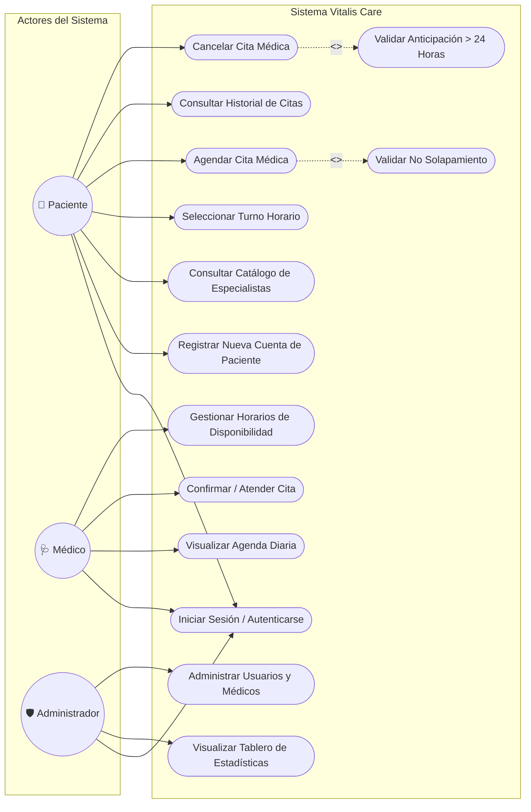
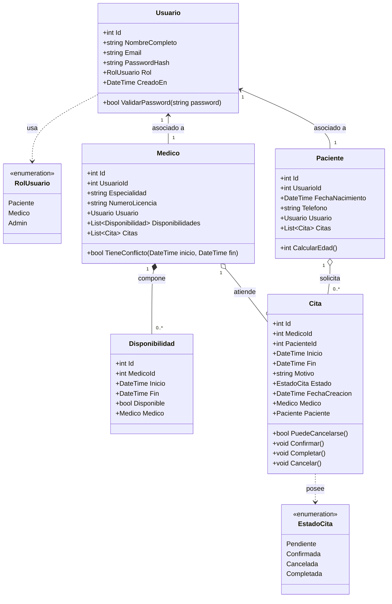
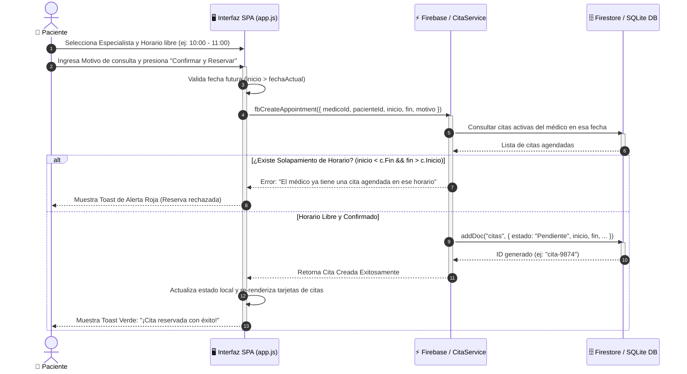
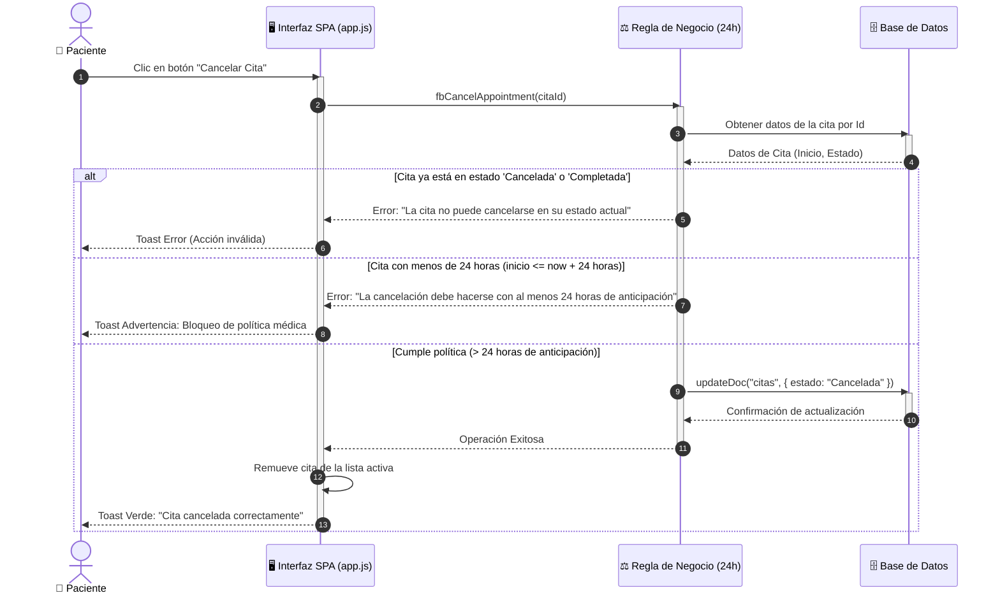
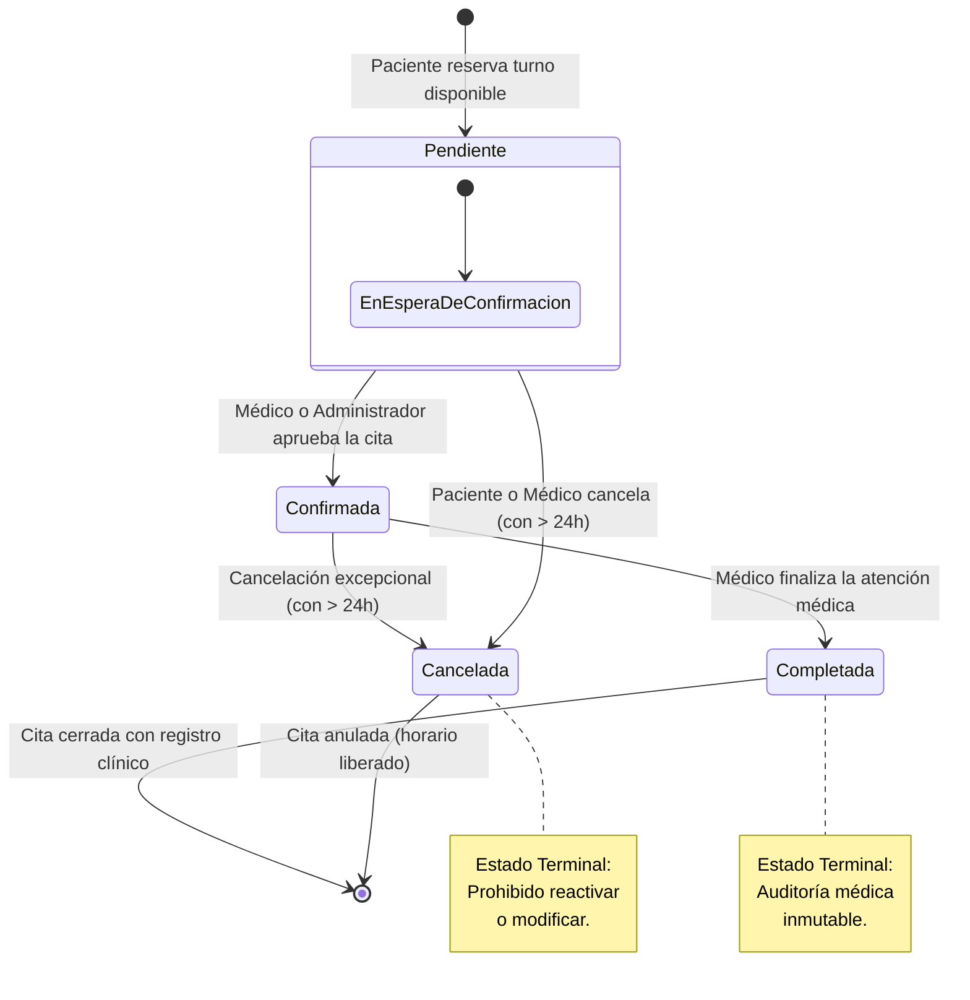
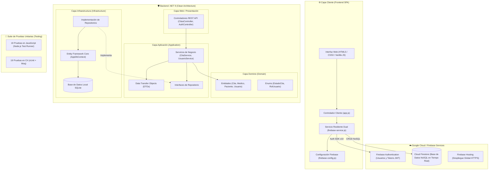
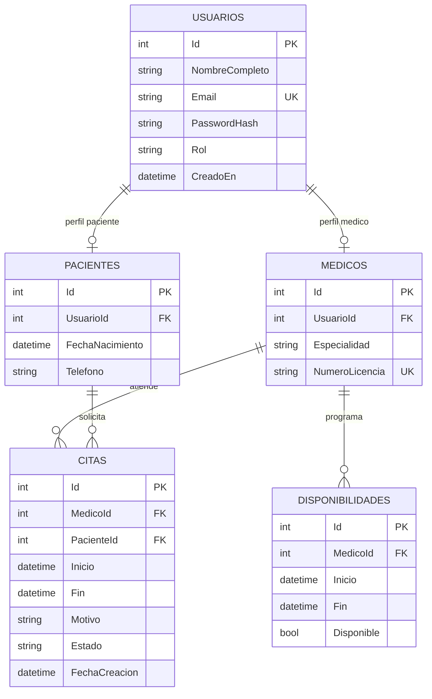

# 📊 DIAGRAMAS UML Y DE ARQUITECTURA: VITALIS CARE
> **Plataforma Integral de Gestión de Citas Médicas y Salud Digital**  
> *Documentación visual y formal para sustentación académica ante jurados y profesores.*

---

## 📑 Índice de Diagramas
1. [Diagrama 1: Casos de Uso del Sistema (UML Use Case Diagram)](#1-diagrama-de-casos-de-uso-uml-use-case-diagram)
2. [Diagrama 2: Clases y Dominio (UML Class Diagram)](#2-diagrama-de-clases-del-dominio-uml-class-diagram)
3. [Diagrama 3: Secuencia — Flujo de Agendamiento de Cita con Validación de Solapamiento](#3-diagrama-de-secuencia--reserva-de-cita-médica)
4. [Diagrama 4: Secuencia — Cancelación de Cita con Regla de 24 Horas](#4-diagrama-de-secuencia--cancelación-de-cita-regla-de-24-horas)
5. [Diagrama 5: Máquina de Estados del Ciclo de Vida de una Cita](#5-diagrama-de-estados-ciclo-de-vida-de-la-cita-médica)
6. [Diagrama 6: Arquitectura de Software (Clean Architecture + Firebase Cloud)](#6-diagrama-de-arquitectura-de-software-clean-architecture--firebase)
7. [Diagrama 7: Modelo Entidad-Relación (DER / Base de Datos)](#7-diagrama-entidad-relación-der--modelo-de-datos)

---

## 1. Diagrama de Casos de Uso (UML Use Case Diagram)

Describe las interacciones de los tres actores del sistema (**Paciente**, **Médico** y **Administrador**) con las funcionalidades y reglas de negocio del sistema.

> **Explicación para el jurado:**
> - El caso de uso **Agendar Cita** tiene un vínculo `<<include>>` con **Validar No Solapamiento**, garantizando que ninguna cita sea persistida si el médico ya tiene un compromiso en ese bloque.
> - El caso de uso **Cancelar Cita** incluye obligatoriamente la regla de negocio de **Anticipación de 24 Horas**.

---

## 2. Diagrama de Clases del Dominio (UML Class Diagram)

Representa las entidades del modelo de dominio, sus atributos tipados, métodos y multiplicidad de relaciones bajo principios de orientación a objetos y Clean Architecture.

> **Explicación para el jurado:**
> - Se aplica el patrón de desacoplamiento entre cuenta de acceso (`Usuario`) y perfiles clínicos (`Paciente`, `Medico`).
> - La clase `Cita` encapsula métodos de negocio (`PuedeCancelarse()`, `Confirmar()`, `Cancelar()`) garantizando que el dominio proteja sus invariantes.

---

## 3. Diagrama de Secuencia — Reserva de Cita Médica

Modela la interacción paso a paso cuando un paciente reserva un horario libre, detallando las validaciones preventivas de solapamiento.

---

## 4. Diagrama de Secuencia — Cancelación de Cita (Regla de 24 Horas)

Demuestra cómo el sistema evalúa la regla de negocio que prohíbe cancelaciones tardías.

---

## 5. Diagrama de Estados: Ciclo de Vida de la Cita Médica

Modela la máquina de estados finitos que gobierna las transiciones legales e ilegales de una cita médica.

---

## 6. Diagrama de Arquitectura de Software (Clean Architecture + Firebase)

Ilustra la estructura desacoplada del sistema: el cliente frontend (SPA), el motor en la nube con Firebase y la API N-Tier en C# .NET 9.

---

## 7. Diagrama Entidad-Relación (DER / Modelo de Datos)

Modela la estructura de tablas relacionales (SQLite / EF Core) y colecciones equivalentes en Firestore.

---

## 💡 Guía Rápida para el Expositor: Cómo Explicar los Diagramas

| Diagrama | Qué responder si el profesor pregunta |
| :--- | :--- |
| **Casos de Uso** | *"Muestra los 3 roles del sistema y destaca que tanto la verificación de no solapamiento como la regla de cancelación de 24h son obligatorias mediante relaciones `<<include>>`."* |
| **Diagrama de Clases** | *"Evidencia el desacoplamiento: las entidades de dominio son ricas en lógica de negocio y están libres de dependencias de bases de datos o frameworks."* |
| **Secuencia de Reserva** | *"Explica cómo el sistema consulta la disponibilidad antes de confirmar, evitando que dos pacientes ocupen el mismo horario simultáneamente."* |
| **Máquina de Estados** | *"Demuestra que los estados 'Cancelada' y 'Completada' son terminales; el sistema impide reactivar citas canceladas para mantener la integridad histórica médica."* |
| **Arquitectura** | *"Muestra cómo conviven la API Clean Architecture en .NET 9 con el servicio en la nube de Firebase, respaldado por 38 pruebas unitarias automatizadas."* |

---
*Documento técnico de soporte arquitectónico para Vitalis Care.*
